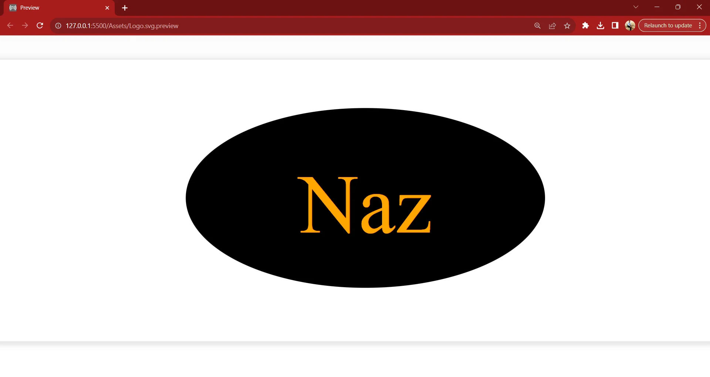

# SVG Logo Maker


## Description
The SVG Logo Maker is a Node.js application that simplifies logo creation by generating a logo just by typing! Easily design logos by manipulating shapes and colors, all within the convenience of this Node.js tool.

### Usage

1. Initiate npm using the following command:
```bash
npm init -y
```

2. Install the required Node.js modules fs and inquirer:
```bash
npm i fs inquirer@8.2.4
```

3. Navigate to the index.js folder in your command line:
```bash
cd path/to/your/index.js
```

4. Run the application by executing either of the following commands:
```bash
node index.js <OR> npm start
```


## Technologies Used
- JavaScript
- Node.js

## Dependencies
- inquirer
- fs


## Test Results
```bash
PASS ./shapes.test.js (6.383 s)SVG to be?  
  Question Attributes
    √ Question instance is created correctly (3 ms)
  Returns a Circle String HTML Element
    √ Checking Circle Class
  Returns a Rectangle String HTML Element
    √ Checking Rectangle Class
  Returns an Ellipse String HTML Element
    √ Checking Ellipse Class (1 ms)
  Returns a Polygon String HTML Element
    √ Checking Polygon Class (1 ms)
```
Video of Application: https://www.youtube.com/watch?v=8H83Leu1Hws

GitHub Repo: https://github.com/Batking74/SVG-Logo-Maker
